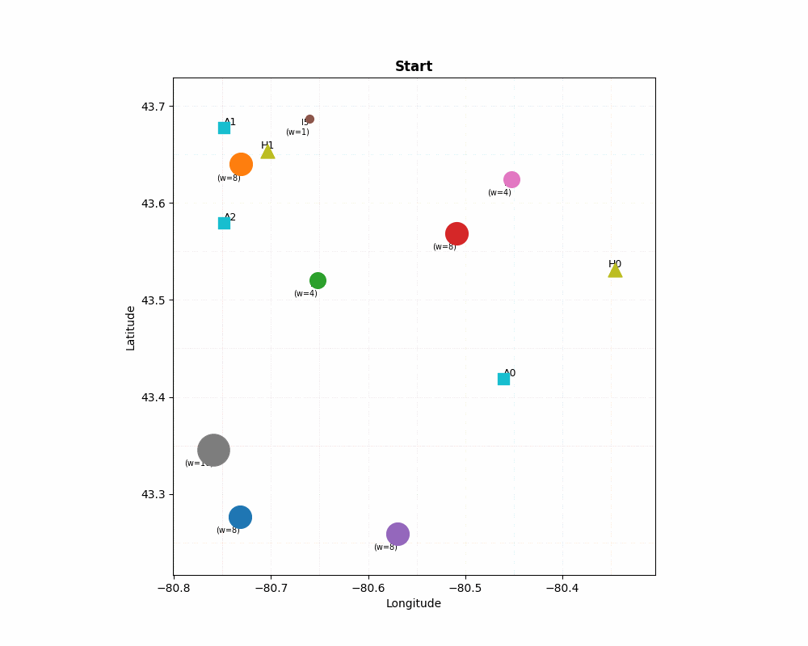

# Ambulance Dispatch Optimization  

---

## Introduction

### **Objective**

The optimization objective is:

$$
\min_{x^{(t)}} \sum_{a \in A} \sum_{i \in R_t} \frac{1}{w_i}\left( d(\text{pos}_a^{(t)}, i) + d(i, h^*(i)) \right) x_{ai}^{(t)}
$$

### **Subject to**

Each ambulance serves at most one incident:

$$
\sum_{i \in R_t} x_{ai}^{(t)} \le 1 \quad \forall a \in A
$$

Each incident is served at most once:

$$
\sum_{a \in A} x_{ai}^{(t)} \le 1 \quad \forall i \in R_t
$$

Exactly \(k_t\) assignments are made:

$$
\sum_{a \in A} \sum_{i \in R_t} x_{ai}^{(t)} = k_t
$$

Binary decision variables:

$$
x_{ai}^{(t)} \in \{0,1\} \quad \forall a \in A, i \in R_t
$$

The first constraint ensures each ambulance serves at most one incident, the second ensures each incident is served at most once, and the third ensures exactly \(k_t\) assignments per round.

---

## Where

- $A$: set of available ambulances, indexed by $a$
- $R_t$: set of unserved incidents at round $t$
- $H$: set of hospitals (fixed locations), indexed by $h$
- $\text{pos}_a^{(t)}$: current position of ambulance $a$ at round $t$
- $d(p, q)$: Google Distance Matrix API distance between coordinates $p$ and $q$
- $h^*(i)$: nearest hospital to incident $i$
- $w_i \in \{1,2,4,8,16\}$: priority weight (larger means higher priority)
- $k_t = \min(|A|, |R_t|)$: number of assignments in round $t$
- $x_{ai}^{(t)}$:
  - **1** if ambulance $a$ is assigned to incident $i$
  - **0** otherwise

---

## Interpretation

The optimization seeks to minimize the total weighted travel cost of all ambulance–incident–hospital assignments during round \(t\).

Each term in the objective contains:

$$
d(\text{pos}_a^{(t)}, i) + d(i, h^*(i))
$$

which is the distance from the ambulance to the incident and then to the nearest hospital.

The weighting factor \(1/w_i\) increases the influence of high-priority incidents by reducing their effective cost relative to lower-priority ones.

## Simulation

